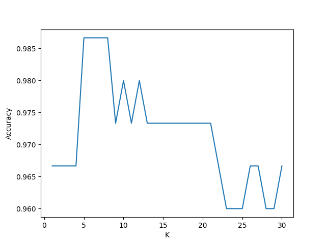
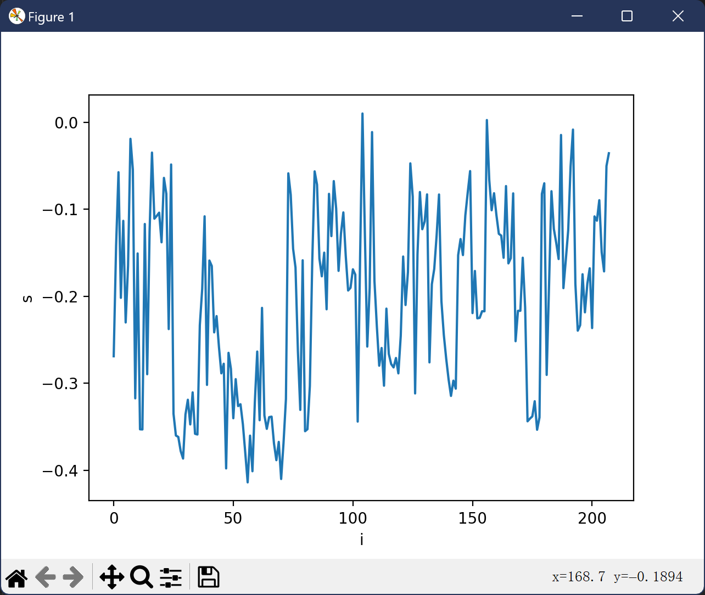
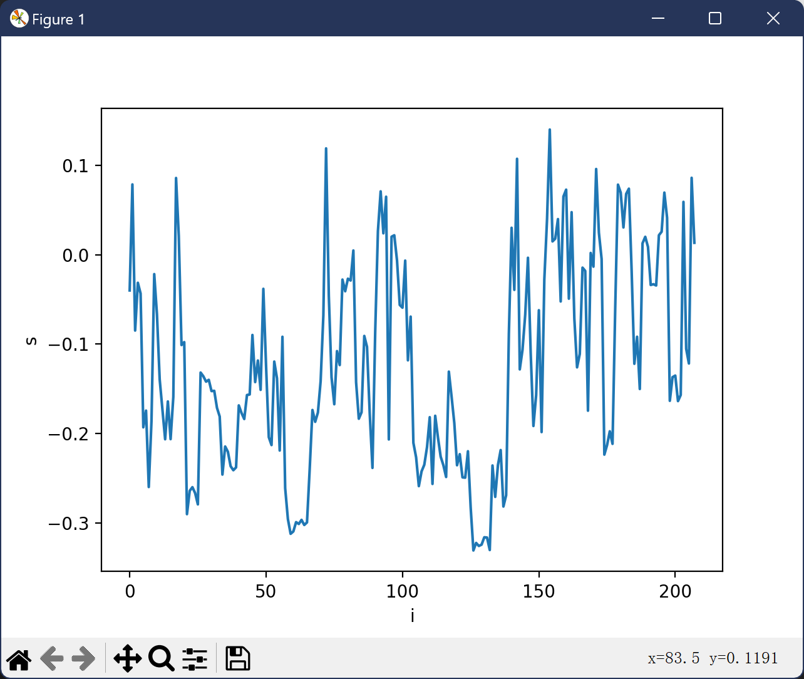

# 实验一：基于k近邻算法的分类器实现

## 1. 算法描述
k近邻算法（k-Nearest Neighbors，k-NN）是一种基本的分类和回归方法。其基本思想是：如果一个样本在特征空间中的k个最相似（即特征空间中最邻近）的样本中的大多数属于某一个类别，则该样本也属于这个类别。

## 2. 算法实现
### 2.1 数据集准备
数据集采用$UCI$机器学习库中的$Iris$数据集，该数据集包含150个样本，每个样本有4个特征和一个标签，标签分为三类。
在此设置了一个`precess_raw_dataset.py`脚本，被原始数据集进行一个随机排列，处理后的数据集存储在`Data\processed\iris_processed.data`。

### 2.2 数据集划分
采用交叉验证法调优超参数$k$， 需要将数据集划分为训练集和测试集，在此设定划分比例`SPLIT_RATIO`，默认值为$0.2$，意在将数据集五等分。

### 2.3 参数设置
- `K`：k近邻算法中的k值，默认最大取值为`30`

### 2.4 距离计算
默认为欧式距离，包含在`judge_target`函数中：

```python
def judge_target(X_test_data: np.array, X_train: np.array, y_train: np.array, k: int):
    ···
    distances = [np.sqrt(np.sum((X_test_data - X_train_data)**2)) for X_train_data in X_train]
    ···
```

### 2.5 类别估计
采用**投票法**，即对距离最近的k个样本的标签进行投票，取票数最多的标签作为预测结果。
```python
def judge_target(X_test_data: np.array, X_train: np.array, y_train: np.array, k: int):
    ···
    sorted_indices = np.argsort(distances)
    top_k_indices = sorted_indices[:k]
    top_k_labels = y_train[top_k_indices]

    target = Counter(top_k_labels).most_common(1)[0][0]
    return target
```

### 2.6 准确度计算
采用**准确率**作为评估指标，即预测正确的样本数占总样本数的比例。
```python
def evaluate_accuracy(k: int, i: int, X_splited: list, y_splited: list):
    ···
    y_pred = [judge_target(X_test_data = np.array(x), X_train = np.array(X_train), y_train = np.array(y_train), k = k) for x in X_test]
    
    accuracy = np.sum(np.array(y_pred) == np.array(y_test))/ len(y_test)
    return accuracy
```

### 2.7 绘制准确度曲线
```python
def draw_accuracy(accuracys: list, k: range):
    """
    绘制准确度曲线。
    """
    import matplotlib.pyplot as plt

    plt.plot(k, accuracys)
    plt.xlabel("K")
    plt.ylabel("Accuracy")
    plt.show()
```
最终的结果如下：


## 3. 总结
k近邻算法是一种简单而有效的分类方法，其准确度与$k$的取值有关。在本文中，我们采用交叉验证法调优$k$，并绘制了准确度曲线。通过实验发现，当$k$取值在$8$左右时，准确度最高。

# 实验二：基于k-means和FCM算法的无监督聚类实现

## 1. 算法描述
### 1.1 k-means算法
k-means算法是一种基于距离的聚类算法，其基本思想是将数据集划分为$k$个簇，使得每个簇内的样本尽可能相似，而不同簇之间的样本尽可能不同。

### 1.2 FCM算法
FCM算法是一种基于模糊聚类的算法，其基本思想是将数据集划分为$k$个簇，使得每个样本属于每个簇的概率尽可能大。

## 2. 算法实现
### 2.1 数据集准备
数据集采用$Sonar$以及$MINIST$数据集，将分别验证算法在两个数据集上的表现。

### 2.2 超参数设置
- `K`：k-means算法中的k值.
- `MAX_ITERATIONS`：迭代次数，默认值为`100`
- `M`：FCM算法中的**模糊系数**，默认值为`2`

### 2.3 算法流程
#### 2.3.1 k-means算法
1. 随机选择$k$个样本作为初始聚类中心。
2. 计算每个样本到聚类中心的距离，将样本分配到距离最近的聚类中心所在的簇。
3. 更新聚类中心为每个簇内样本的均值。
4. 重复步骤2和步骤3，直到聚类中心不再发生变化或者达到最大迭代次数。

#### 2.3.2 FCM算法
1. 随机初始化聚类中心。
2. 根据数据集和聚类中心更新隶属度矩阵，计算公式为：
$$
u_{ij} = \frac{(\frac{1}{x_{j} - c_{i}})^{\frac{1}{m-1}}}{\sum_{k=1}^{k}(x_{j}-c_{k})^{\frac{1}{m-1}}}
$$
其中，$d_{ij}$表示第$i$个样本到第$j$个聚类中心的距离，$m$为模糊系数。
3. 根据隶属度矩阵更新聚类中心，计算公式为：
$$
c_j = \frac{\sum_{i=1}^{n}u_{ij}^m x_i}{\sum_{i=1}^{n}u_{ij}^m}
$$
4. 重复步骤2和步骤3，直到隶属度矩阵不再发生变化或者达到最大迭代次数。

### 2.4 评价标准
采用**轮廓系数**作为评价标准，其计算公式为：
$$
s_{i} = \frac{b_{i} - a_{i}}{\max(a_{i}, b_{i})}
$$
其中，$a_{i}$表示样本$i$到同簇其他样本的平均距离，$b_{i}$表示样本$i$到最近的其他簇的平均距离。

### 2.5 实验结果




## 3. 总结
本文实现了基于k-means和FCM算法的无监督聚类，对$Sonar$数据集进行了实验。实验结果表明，k-means算法在$Sonar$数据集上表现较好。

# 实验三：基于svm算法的监督分类实现

## 1. 算法描述
### 1.1 概述
**支持向量机**（Support Vector Machine，SVM）是一种监督学习算法，主要用于分类和回归问题。其基本思想是通过最大化分类间隔来找到一个最优的超平面，使得分类器对训练数据的分类效果最好。

### 1.2 具体步骤
SVM算法的基本思想是通过最大化分类间隔来找到一个最优的超平面，使得分类器对训练数据的分类效果最好。其基本步骤如下：
1. 确定超平面：通过求解一个二次规划问题，找到一个最优的超平面，使得**分类间隔最大**。
2. 分类：对于新的样本，通过计算样本到超平面的距离，判断样本属于哪个类别。
3. 优化：通过调整超平面的参数，使得分类器对训练数据的分类效果更好。
4. 评估：通过交叉验证等方法，评估分类器的性能。
5. 预测：对于新的样本，通过分类器进行预测。
6. 调优：通过**调整超参数**，使得分类器对训练数据的分类效果更好。

## 2. 代码实现
### 2.1 数据集准备
数据集采用$Sonar$数据集，将验证算法在此数据集上的表现。

### 2.2 超参数设置
- `C`：惩罚参数，默认值为`1.0`
- `TOL`：容忍度，默认值为`1e-3`
- `MAX_ITER`：最大迭代次数，默认值为`100`
  
### 2.3 算法流程
1. `_clean_label`函数用于转换标签([1, -1](#fn1))。
2. `_evaluate_deviation`用来计算误差。公式如下：
   $$
   \text{error} = f(x_i) - y_i = \sum_{j=1}^{n} \alpha_j y_j K(x_i, x_j) + b - y_i
   $$
   其中，$K(x_i, x_j)$表示样本$x_i$和$x_j$之间的核函数值，$b$表示偏置项。
3. 计算上界$L$和下界$H$。公式如下：
   $$
   L = \begin{cases}
    \max(0, {\alpha_j}^{old} - {\alpha_i}^{old}) \quad H = \min(C, C + {\alpha_j}^{old} - {\alpha_i}^{old}) if \quad y_i \neq y_j \\
    \max(0, {\alpha_j}^{old} + {\alpha_i}^{old} - C) \quad H = \min(C, {\alpha_j}^{old} + {\alpha_i}^{old}) if \quad y_i = y_j
   \end{cases}
   $$
4. 计算$\eta$。
   $$
   \eta = K(x_i, x_i) + K(x_j, x_j) - 2K(x_i, x_j)
   $$
5. 更新$\alpha_j$。
   $$
   \alpha_j^{new} = \alpha_j^{old} + \frac{y_j (E_i - E_j)}{\eta}
   $$
6. 修剪$\alpha_j$。
   $$
   \alpha_j^{new} = \begin{cases}
   H & \text{if } \alpha_j^{new} > H \\
   L & \text{if } \alpha_j^{new} < L \\
   \alpha_j^{new} & \text{otherwise}
   \end{cases}
   $$
7. 更新$\alpha_i$。
   $$
   \alpha_i^{new} = \alpha_i^{old} + y_i y_j (\alpha_j^{old} - \alpha_j^{new})
   $$
8. 更新$b_1$和$b_2$。
   $$
   b_1^{new} = -E_i - y_i K(x_i, x_i) (\alpha_i^{new} - \alpha_i^{old}) - y_j K(x_i, x_j) (\alpha_j^{new} - \alpha_j^{old}) + b_1^{old}
   $$
   $$
   b_2^{new} = -E_j - y_i K(x_i, x_j) (\alpha_i^{new} - \alpha_i^{old}) - y_j K(x_j, x_j) (\alpha_j^{new} - \alpha_j^{old}) + b_2^{old}
   $$
9. 更新$b$。
   $$
   b = \frac{b_1^{new} + b_2^{new}}{2}
   $$

## 3. 实验结果
实验结果如下：
```python
Classification Report:
              precision    recall  f1-score   support

           -1       0.85      0.87      0.86        93
           1       0.83      0.81      0.82        67

    accuracy                           0.84       160
   macro avg       0.84      0.84      0.84       160
weighted avg       0.84      0.84      0.84       160

Accuracy Score: 0.84375
Confusion Matrix:
[[79 14]
 [10 57]]
```
分类器的准确率约为84%。

## 4. 总结
本次实验实现了支持向量机算法，并对其进行了调优。实验结果表明，该算法在$Sonar$数据集上的分类效果较好，能够有效地区分Mines和Rocks，这表明$SVM$在处理此类**二分类**问题上具有较高的准确性。