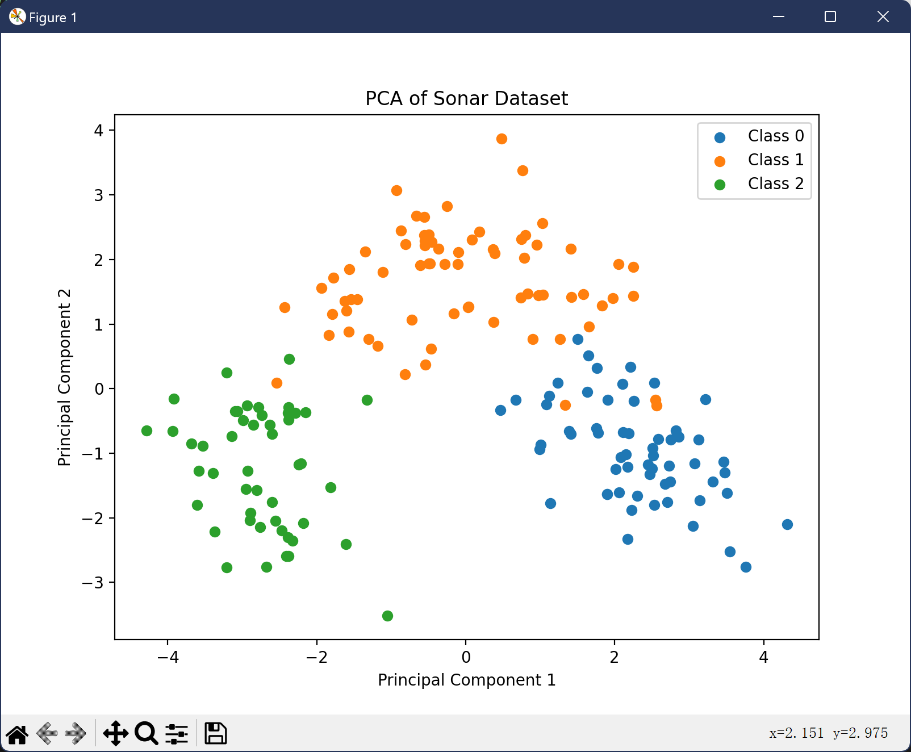
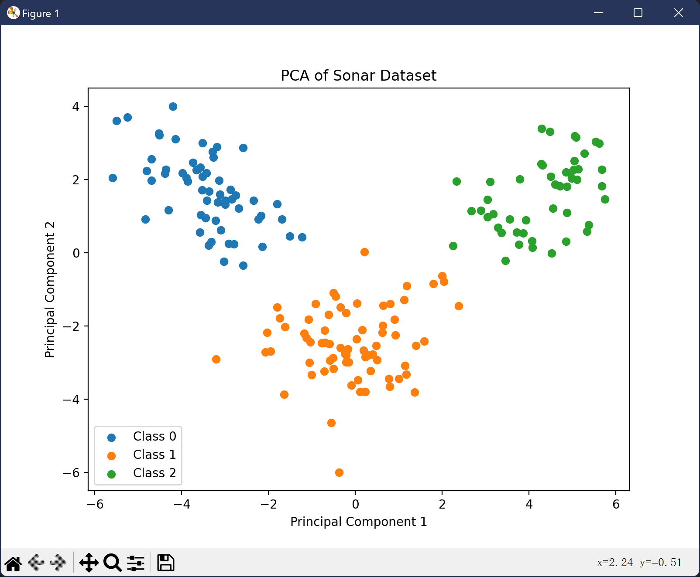
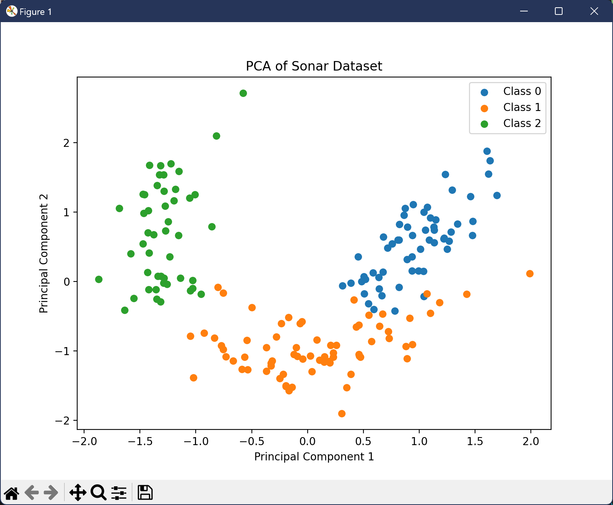

# 维数约简的方法
## 1. 概述
维数约简是降维的一种方法，其目的是通过减少数据的维度来**降低计算复杂度**，同时尽可能**保留原始数据的重要信息**。维数约简的方法有很多种，包括主成分分析（PCA）、线性判别分析（LDA）、因子分析（FA）、独立成分分析（ICA）等。

## 2. 主成分分析（PCA）
主成分分析是一种常用的维数约简方法，其将大量相关变量转换为几组无关的变量，这些变量称为**主成分**。
代码实现：
```python
from sklearn.decomposition import PCA
pca = PCA(n_components=2)
X_pca = pca.fit_transform(X)
```
在$Sonar$数据集上，使用PCA将数据从60维降至2维，得到的结果如下：


## 3. 线性判别分析（LDA）
线性判别分析是一种**有监督**的降维方法，不仅保留原始数据的方差，还最大化不同类别之间的差异，在建模过程中需要用到目标变量。LDA只能用于分类问题。
代码实现：
```python
from sklearn.discriminant_analysis import LinearDiscriminantAnalysis as LDA
lda = LDA(n_components=2)
X_lda = lda.fit_transform(X, y)
```
约简结果：


## 4. 因子分析（FA）
因子分析是一种**无监督**的降维方法，通过寻找一组潜在的变量（因子）来解释原始数据中的方差。FA假设原始数据是由这些因子和随机误差的线性组合构成的。
代码实现：
```python
from sklearn.decomposition import FactorAnalysis
fa = FactorAnalysis(n_components=2)
X_fa = fa.fit_transform(X)
```
约简结果：


## 5. 独立成分分析（ICA）
独立成分分析是一种**无监督**的降维方法，其假设数据是由一组独立的非高斯源信号线性混合而成的。ICA的目标是分离出这些源信号。
代码实现：
```python
from sklearn.decomposition import FastICA
ica = FastICA(n_components=2)
X_ica = ica.fit_transform(X)
```