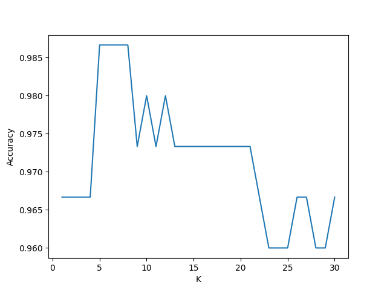

# 基于k近邻算法的分类器实现

## 1. 算法描述
k近邻算法（k-Nearest Neighbors，k-NN）是一种基本的分类和回归方法。其基本思想是：如果一个样本在特征空间中的k个最相似（即特征空间中最邻近）的样本中的大多数属于某一个类别，则该样本也属于这个类别。

## 2. 算法实现
### 2.1 数据集准备
数据集采用$UCI$机器学习库中的$Iris$数据集，该数据集包含150个样本，每个样本有4个特征和一个标签，标签分为三类。
在此设置了一个`precess_raw_dataset.py`脚本，被原始数据集进行一个随机排列，处理后的数据集存储在`Data\processed\iris_processed.data`。

### 2.2 数据集划分
采用交叉验证法调优超参数$k$， 需要将数据集划分为训练集和测试集，在此设定划分比例`SPLIT_RATIO`，默认值为$0.2$，意在将数据集五等分。

### 2.3 参数设置
- `K`：k近邻算法中的k值，默认最大取值为`30`

### 2.4 距离计算
默认为欧式距离，包含在`judge_target`函数中：

```python
def judge_target(X_test_data: np.array, X_train: np.array, y_train: np.array, k: int):
    ···
    distances = [np.sqrt(np.sum((X_test_data - X_train_data)**2)) for X_train_data in X_train]
    ···
```

### 2.5 类别估计
采用**投票法**，即对距离最近的k个样本的标签进行投票，取票数最多的标签作为预测结果。
```python
def judge_target(X_test_data: np.array, X_train: np.array, y_train: np.array, k: int):
    ···
    sorted_indices = np.argsort(distances)
    top_k_indices = sorted_indices[:k]
    top_k_labels = y_train[top_k_indices]

    target = Counter(top_k_labels).most_common(1)[0][0]
    return target
```

### 2.6 准确度计算
采用**准确率**作为评估指标，即预测正确的样本数占总样本数的比例。
```python
def evaluate_accuracy(k: int, i: int, X_splited: list, y_splited: list):
    ···
    y_pred = [judge_target(X_test_data = np.array(x), X_train = np.array(X_train), y_train = np.array(y_train), k = k) for x in X_test]
    
    accuracy = np.sum(np.array(y_pred) == np.array(y_test))/ len(y_test)
    return accuracy
```

### 2.7 绘制准确度曲线
```python
def draw_accuracy(accuracys: list, k: range):
    """
    绘制准确度曲线。
    """
    import matplotlib.pyplot as plt

    plt.plot(k, accuracys)
    plt.xlabel("K")
    plt.ylabel("Accuracy")
    plt.show()
```
最终的结果如下：


## 3. 总结
k近邻算法是一种简单而有效的分类方法，其准确度与$k$的取值有关。在本文中，我们采用交叉验证法调优$k$，并绘制了准确度曲线。通过实验发现，当$k$取值在$8$左右时，准确度最高。